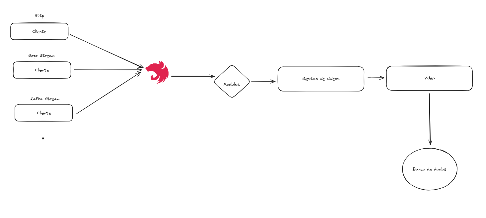

# TEST

### Pontos importantes (O que a aplicacao faz hoje)

- Aplicacao feita em nestjs 
- Exitem duas rotas na aplicacao um POST e um GET (Estar na dcumentacao)
- Faz upload de videos e faz a concatenacao dos videos (video = video1+video2)

### Pontos de melhorias 
- Pode ser feita comunicacao via gRPC de forma unaria, bidirecional usando stream 
- Pode ser feita por message brocker com o apache kafka via stream
- Melhorias na tipagem do codigo 
- Melhoria na documentacao 

#### Exemplo de upload de videos 
### Em gif


### Em .MP4

[exemplo2.mp4](..%2F..%2F..%2FDownloads%2Fexemplo2.mp4)


```
Desenvolva uma API para gestão de vídeos usando nodejs e, preferencialmente, nestjs.
Essa API deve conter 2 endpoints rest.

Concatenação de vídeos

Esse endpoint deve receber um arquivo zip com arquivos de vídeo, e o resultado esperado é um vídeo de saída com os clipes concatenados;
Os metadados dos clips deve ser salvos em um banco de dados nosql;
O processo deve ser assíncrono e deve armazenar o status num banco de dados nosql.

Consulta de processo de concatenação

Esse endpoint deve retornar o status atual do processamento de concatenação de um vídeo e caso esteja completo, retornar a url para download do vídeo.
FFMPEG
```

## Munual para rodar a aplicacao
#### Instalar dependencias versao do projeto node 20.11.0 

```
npm i 
```
#### Executar o banco de dados MongoDB
```
docker compose up -d 
```
#### Executar a aplicacao nestjs

```
npm run start:dev 
```

### Estrutura do banco de dados


### Enpoints exportado do insomnia

[Insomnia_2024-02-15.json](Insomnia_2024-02-15.json)


### Explicacao
- O upload do video sera salvo nesse caminho test/dist/videos
- O merge dos videos sera salvo nesse caminho test/dist/output
- O arquivo criado para identificar o caminhos dos videos a serem mergeados test/dist/temp
